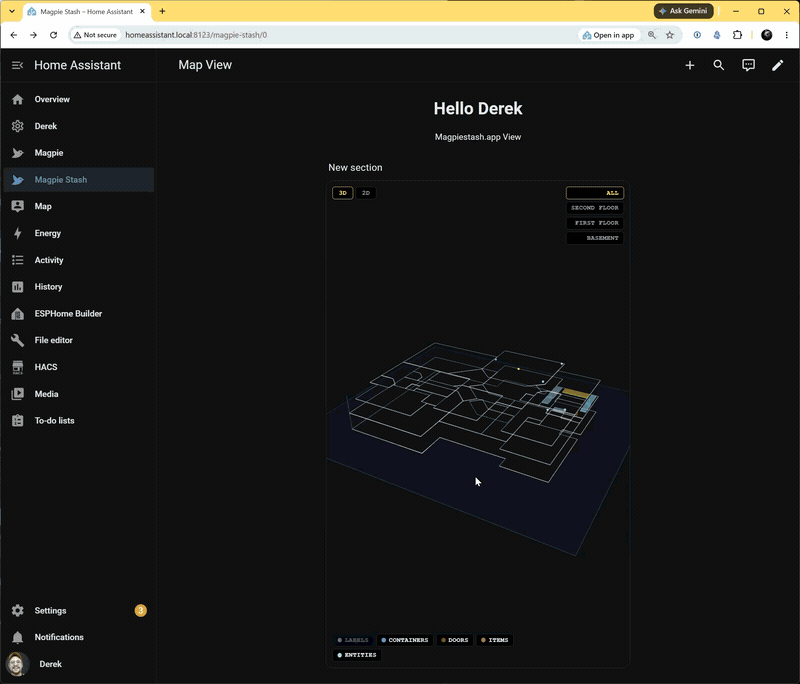

# Magpie Spatial Card

A Home Assistant Lovelace card that renders your [MagpieStash](https://magpiestash.app) home inventory map in 3D or as a flat 2D floor plan - with your Home Assistant entities placed in real rooms, lit by live state, straight from your dashboard.



- **3D and 2D views** of your actual floor plan: orbit, pan, and zoom, with a live toggle on the card.
- **Live entity states** with no polling: markers glow the instant a light, switch, or sensor changes, fed by the `hass` object your dashboard already holds.
- **Click an entity** to open Home Assistant's own more-info dialog.
- **Floor selector and legend**: slice multi-floor homes and toggle labels, containers, doors, items, and entities.
- **Read-only by design**: the card authenticates to MagpieStash with a scoped token that can only read your map layout. It cannot act as you, and device control stays entirely inside Home Assistant.

## Prerequisites

1. A [MagpieStash](https://magpiestash.app) account (free tier works) with your home mapped - rooms drawn, and Home Assistant entities imported and placed on the map.
2. A card token: in MagpieStash go to **Settings -> Home Assistant Card -> Generate token**.

## Installation

### HACS (recommended)

1. In HACS: **Custom repositories** -> add this repository's URL with type **Dashboard**.
2. Install **Magpie Spatial Card**.
3. HACS registers the resource automatically. If your dashboard is in YAML mode, add:

```yaml
lovelace:
  resources:
    - url: /hacsfiles/magpie-spatial-card/magpie-spatial-card.js
      type: module
```

### Manual (no HACS)

Add the card straight from your MagpieStash origin as a dashboard resource (Settings -> Dashboards -> Resources, type **JavaScript module**):

```
https://magpiestash.app/static/js/magpie-spatial-card.js
```

## Card configuration

```yaml
type: custom:magpie-spatial-card
magpie_url: https://magpiestash.app
token: <paste from MagpieStash Settings -> Home Assistant Card>
```

| Option | Required | Default | Description |
|---|---|---|---|
| `token` | yes | - | Read-only card token minted in MagpieStash Settings. |
| `magpie_url` | no | `https://magpiestash.app` | Your MagpieStash instance. |
| `property_id` | no | first property | Which mapped property to show. |
| `height` | no | `420` | Card height in pixels. |
| `view` | no | `3d` | Starting view: `3d` (orbit) or `2d` (top-down floor plan). |

## How it works

The card fetches your map **layout** once from MagpieStash (rooms, floors, markers) using the read-only token, and reads entity **state** directly from Home Assistant - so state updates are instant and nothing polls. The 3D renderer itself streams from your MagpieStash instance, so rendering improvements arrive without a card update.

Revoking access takes one click in MagpieStash Settings (**Revoke all card tokens**); every outstanding token dies instantly.

## Development

The card's source of truth lives in the MagpieStash application repository; this repository is the HACS distribution mirror. Issues and feature requests are welcome here.
